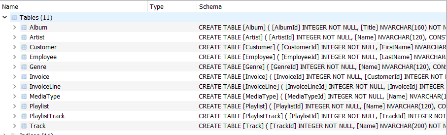
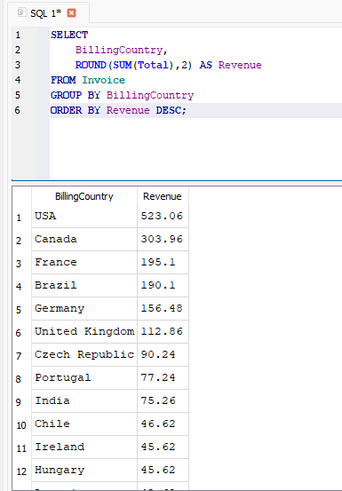
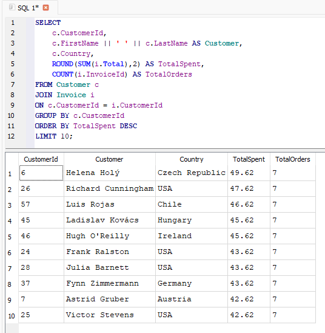
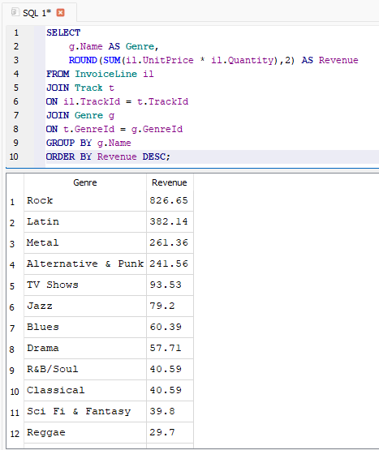

# SQL Business Analysis of the Chinook Music Store Database

## Overview

This project presents an end-to-end business analysis of the Chinook Music Store database using SQL. The objective is to analyze sales performance, customer behavior, and product trends by answering business-focused questions using real transactional data.

Rather than focusing solely on SQL syntax, this project demonstrates how SQL can be applied to extract meaningful insights and support data-driven business decisions through clear analysis and actionable recommendations.

---

## Project Objectives

This analysis aims to answer the following business questions:

- What is the company's total revenue?
- Which countries and cities generate the highest revenue?
- Who are the highest-value customers?
- Which music genres, artists, and albums perform best?
- How can business performance be improved through data-driven recommendations?

---

## Dataset

**Database:** Chinook SQLite Database

The Chinook database simulates a digital music store and contains transactional data related to customers, invoices, employees, artists, albums, tracks, playlists, and genres.

### Dataset Statistics

| Metric | Value |
|---------|------:|
| Customers | 59 |
| Invoices | 412 |
| Invoice Line Items | 3,503 |
| Countries | 24 |
| Database | SQLite |

---

## Database Schema



## SQL Skills Demonstrated

Throughout this project, the following SQL concepts were applied:

- SELECT statements
- Filtering using WHERE
- Aggregate Functions (`SUM`, `AVG`, `COUNT`)
- GROUP BY
- ORDER BY
- INNER JOIN
- Multi-table JOINs
- Window Functions (`RANK`)
- Business KPI Analysis
- Data Aggregation

---

## Business Questions Answered

### Sales Analysis

- Total company revenue
- Revenue by country
- Revenue by city
- Average invoice value
- Monthly revenue trend

### Customer Analysis

- Top customers by spending
- Customer distribution by country
- Customers with the highest number of purchases
- Average customer spending
- Customer ranking by revenue

### Product Analysis

- Highest revenue-generating genres
- Top-performing artists
- Highest revenue-generating albums
- Most purchased tracks
- Most popular media types

---

## Key Findings

- Generated **2,329.00** in total revenue across **412 invoices**.
- The **United States** generated the highest revenue (**523.06**), making it the strongest-performing market.
- **Prague** was the highest revenue-generating city (**90.24**).
- **Rock** was the highest-performing genre, generating **826.65** in revenue—more than twice that of the second-ranked genre.
- **Iron Maiden** generated the highest artist revenue (**138.60**).
- The average invoice value was **5.65**, indicating relatively small individual transactions.

## Sample Analysis

### Revenue by Country



---

### Top Customers



---

### Revenue by Genre


---

## Business Recommendations

Based on the analysis, the following recommendations are proposed:

- Continue investing in the United States, the company's strongest revenue-generating market.
- Expand the Rock music catalog and related marketing campaigns to capitalize on sustained customer demand.
- Introduce customer loyalty or rewards programs targeting high-value customers.
- Increase promotional activities in high-performing cities to strengthen customer engagement.
- Improve the average invoice value through product bundles, cross-selling, and personalized recommendations.

---

## Tools Used

- SQL
- SQLite
- DB Browser for SQLite
- Visual Studio Code
- Git
- GitHub

---

## Repository Structure

```text
SQL-Chinook-Analysis/
│
├── README.md
├── queries.sql
├── insights.md
│
├── database/
│   └── Chinook_Sqlite.sqlite
│
└── screenshots/
    ├── database_schema.png
    ├── revenue_by_country.png
    └── top_customers.png
```

## How to Run

1. Clone or download this repository.
2. Open the `database/Chinook_Sqlite.sqlite` database using **DB Browser for SQLite**.
3. Execute the SQL queries from `queries.sql`.
4. Review the analysis and business insights in `insights.md`.

## Conclusion

This project demonstrates how SQL can be used to analyze business performance using a relational database. By combining SQL queries with business interpretation, the analysis transforms raw transactional data into actionable insights that can support informed business decisions.

---

## About This Project

This project was completed as part of my data analytics learning journey to strengthen my SQL, analytical thinking, and business problem-solving skills.

Rather than simply writing SQL queries, I focused on communicating insights, identifying trends, and providing practical business recommendations—skills that are essential for real-world data analysts.